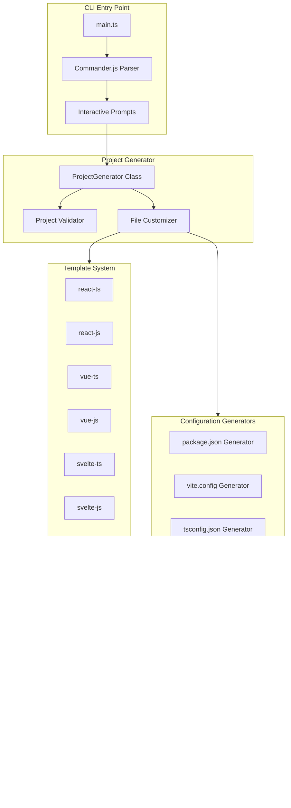

# Design Document: CLI Modernization

## Overview

This design document outlines the modernization of the `create-viant-app` CLI tool. The modernization involves updating all dependencies to their latest stable versions, enhancing templates with modern technologies, and ensuring the CLI works reliably across all supported package managers and platforms.

The CLI is a Node.js/TypeScript application that uses Commander.js for argument parsing, Prompts for interactive input, and fs-extra for file operations. It generates project scaffolds by copying template directories and customizing configuration files based on user selections.

## Architecture



## Components and Interfaces

### 1. CLI Entry Point (index.ts)

The main entry point handles command-line argument parsing and orchestrates the project generation flow.

```typescript
interface CLIOptions {
  template?: string;
  styling?: string;
  packageManager?: string;
  skipInstall?: boolean;
  skipGit?: boolean;
  skipDev?: boolean;
}

interface ProjectOptions {
  name: string;
  template: string;
  framework: string;
  styling: string;
  packageManager: string;
  features: string[];
  installDeps: boolean;
  initGit: boolean;
  typescript: boolean;
  runDev?: boolean;
  stateManagement?: string;
  apiClient?: string;
}
```

### 2. Package Manager Detector

Detects available package managers and returns them in preference order.

```typescript
function detectPackageManagers(): string[] {
  // Returns ['bun', 'pnpm', 'yarn', 'npm'] filtered by availability
  // Order: bun > pnpm > yarn > npm (by preference)
}
```

### 3. Project Generator Class

Core class responsible for generating the project structure.

```typescript
class ProjectGenerator {
  constructor(options: ProjectOptions);
  
  async generate(): Promise<void>;
  private validateProjectDir(): void;
  private copyTemplateFiles(): Promise<void>;
  private customizeFiles(): Promise<void>;
  private customizePackageJson(): void;
  private addStylingDependencies(pkg: PackageJson): void;
  private addFeatureDependencies(pkg: PackageJson): void;
  private addFrameworkDependencies(pkg: PackageJson): void;
  private addStylingConfigs(): void;
  private addFeatureConfigs(): void;
  private initializeGit(): Promise<void>;
  private installDependencies(): Promise<void>;
  private runDevServer(): Promise<void>;
  private showCompletionMessage(): void;
  private cleanup(): void;
}
```

### 4. Dependency Version Constants

Centralized version management for all dependencies.

```typescript
const VERSIONS = {
  // Frameworks
  react: '^19.0.0',
  reactDom: '^19.0.0',
  vue: '^3.5.13',
  svelte: '^5.16.0',
  solid: '^1.9.4',
  preact: '^10.25.4',
  
  // Build Tools
  vite: '^6.0.7',
  typescript: '^5.7.2',
  
  // Vite Plugins
  vitePluginReact: '^4.3.4',
  vitePluginReactSWC: '^3.7.2',
  vitePluginVue: '^5.2.1',
  vitePluginSvelte: '^5.0.3',
  vitePluginSolid: '^2.11.0',
  preactPresetVite: '^2.9.4',
  vitePluginPWA: '^0.21.1',
  
  // Styling
  tailwindcss: '^4.0.0',
  unocss: '^0.65.3',
  vanillaExtract: '^1.16.1',
  sass: '^1.83.1',
  styledComponents: '^6.1.14',
  emotion: '^11.14.0',
  
  // Testing
  vitest: '^3.0.2',
  playwright: '^1.49.1',
  testingLibraryReact: '^16.2.0',
  
  // Linting
  biome: '^1.9.4',
  
  // State Management
  reduxToolkit: '^2.5.0',
  zustand: '^5.0.2',
  jotai: '^2.11.0',
  pinia: '^2.3.0',
  
  // API Clients
  tanstackQuery: '^5.64.1',
  swr: '^2.3.0',
  axios: '^1.7.9',
  
  // Utilities
  husky: '^9.1.7',
  storybook: '^8.5.0',
} as const;
```

## Data Models

### PackageJson Interface

```typescript
interface PackageJson {
  name: string;
  version: string;
  type: 'module';
  scripts: Record<string, string>;
  dependencies: Record<string, string>;
  devDependencies: Record<string, string>;
  description?: string;
  author?: string;
  license?: string;
  keywords?: string[];
}
```

### Template Configuration

```typescript
interface TemplateConfig {
  framework: string;
  language: 'ts' | 'js';
  vitePlugin: string;
  typeDefinitions?: string[];
  buildCommand: string;
}

const TEMPLATE_CONFIGS: Record<string, TemplateConfig> = {
  'react-ts': {
    framework: 'react',
    language: 'ts',
    vitePlugin: '@vitejs/plugin-react-swc',
    typeDefinitions: ['@types/react', '@types/react-dom'],
    buildCommand: 'tsc -b && vite build'
  },
  // ... other templates
};
```

### Styling Configuration

```typescript
interface StylingConfig {
  dependencies: Record<string, string>;
  devDependencies: Record<string, string>;
  configFiles: ConfigFile[];
  cssContent?: string;
}

interface ConfigFile {
  path: string;
  content: string;
}
```

## Correctness Properties

*A property is a characteristic or behavior that should hold true across all valid executions of a system-essentially, a formal statement about what the system should do. Properties serve as the bridge between human-readable specifications and machine-verifiable correctness guarantees.*

### Property 1: Package Manager Detection Order
*For any* set of available package managers on a system, the detectPackageManagers function SHALL return them in the order: bun, pnpm, yarn, npm (filtered by availability).
**Validates: Requirements 1.5**

### Property 2: Framework Version Correctness
*For any* framework selection (React, Vue, Svelte, Solid, Preact) and language choice (TypeScript/JavaScript), the generated package.json SHALL contain the correct framework version as specified in the VERSIONS constant.
**Validates: Requirements 3.1, 3.2, 3.3, 3.4, 3.5**

### Property 3: Build Tool Version Correctness
*For any* generated template, the package.json SHALL contain Vite version 6.x or later and (for TypeScript templates) TypeScript version 5.7.x or later.
**Validates: Requirements 3.6, 3.7**

### Property 4: Feature Dependency Correctness
*For any* selected feature (linting, testing, E2E, Storybook, git hooks), the generated package.json SHALL contain the correct dependency version as specified in the VERSIONS constant.
**Validates: Requirements 4.1, 4.2, 4.3, 4.4, 4.5**

### Property 5: Styling Dependency Correctness
*For any* selected styling option (Tailwind, UnoCSS, vanilla-extract, Sass, styled-components), the generated package.json SHALL contain the correct dependency version as specified in the VERSIONS constant.
**Validates: Requirements 5.1, 5.2, 5.3, 5.4, 5.5**

### Property 6: State Management Dependency Correctness
*For any* selected state management option (Redux Toolkit, Zustand, Jotai, Pinia, TanStack Query), the generated package.json SHALL contain the correct dependency version as specified in the VERSIONS constant.
**Validates: Requirements 6.1, 6.2, 6.3, 6.4, 6.5**

### Property 7: Generated Package.json Validity
*For any* combination of project options, the generated package.json SHALL be valid JSON containing all required fields (name, version, type, scripts, dependencies, devDependencies).
**Validates: Requirements 9.1**

### Property 8: CLI Flag Effect Correctness
*For any* CLI flag provided (--template, --styling, --skip-install, --skip-git), the generated project SHALL reflect that flag's effect (correct template used, correct styling configured, no node_modules if skip-install, no .git if skip-git).
**Validates: Requirements 11.2, 11.3, 11.4, 11.5**

### Property 9: Project Structure Correctness
*For any* generated project, the project SHALL contain the expected directory structure (src/, with appropriate subdirectories), a valid .gitignore file, and ESM module configuration ("type": "module").
**Validates: Requirements 12.1, 12.2, 12.3**

### Property 10: Path Alias Configuration
*For any* generated TypeScript template, the tsconfig.json SHALL contain path alias configuration mapping "@/*" to "./src/*".
**Validates: Requirements 7.5**

### Property 11: TypeScript Strict Mode
*For any* generated TypeScript template, the tsconfig.json SHALL have strict mode enabled. When the strict-ts feature is selected, additional strict flags (noUncheckedIndexedAccess, exactOptionalPropertyTypes) SHALL be enabled.
**Validates: Requirements 8.1, 8.4**

### Property 12: Error Cleanup
*For any* error that occurs during project generation after the project directory is created, the cleanup function SHALL remove the partially created project directory.
**Validates: Requirements 10.4**

## Error Handling

### Error Categories

1. **Validation Errors**: Invalid project name, directory already exists
2. **File System Errors**: Permission denied, disk full, template not found
3. **Network Errors**: Package installation failures
4. **Process Errors**: Git initialization failures, dev server failures

### Error Handling Strategy

```typescript
class ProjectGenerationError extends Error {
  constructor(
    message: string,
    public readonly code: string,
    public readonly recoverable: boolean = false
  ) {
    super(message);
    this.name = 'ProjectGenerationError';
  }
}

// Error codes
const ERROR_CODES = {
  INVALID_NAME: 'INVALID_NAME',
  DIR_EXISTS: 'DIR_EXISTS',
  TEMPLATE_NOT_FOUND: 'TEMPLATE_NOT_FOUND',
  COPY_FAILED: 'COPY_FAILED',
  INSTALL_FAILED: 'INSTALL_FAILED',
  GIT_FAILED: 'GIT_FAILED',
} as const;
```

### Cleanup on Failure

When an error occurs after the project directory is created, the cleanup function removes the partial project:

```typescript
private cleanup(): void {
  if (existsSync(this.projectPath)) {
    rmSync(this.projectPath, { recursive: true, force: true });
  }
}
```

## Testing Strategy

### Dual Testing Approach

This project uses both unit tests and property-based tests to ensure comprehensive coverage:

- **Unit tests** verify specific examples, edge cases, and integration points
- **Property-based tests** verify universal properties that should hold across all inputs

### Property-Based Testing Framework

**Framework**: fast-check (https://github.com/dubzzz/fast-check)

fast-check is chosen because:
- Native TypeScript support
- Excellent shrinking for minimal failing examples
- Rich set of built-in arbitraries
- Active maintenance and community

### Test Configuration

```typescript
// vitest.config.ts
import { defineConfig } from 'vitest/config';

export default defineConfig({
  test: {
    globals: true,
    environment: 'node',
    include: ['src/**/*.test.ts', 'src/**/*.property.test.ts'],
    coverage: {
      provider: 'v8',
      reporter: ['text', 'json', 'html'],
    },
  },
});
```

### Property Test Structure

Each property-based test MUST:
1. Be tagged with a comment referencing the correctness property: `**Feature: cli-modernization, Property {number}: {property_text}**`
2. Run a minimum of 100 iterations
3. Use appropriate generators for the input domain

### Test Categories

1. **Unit Tests**
   - Version constant validation
   - Package.json generation
   - Config file generation
   - Error handling

2. **Property-Based Tests**
   - Package manager detection ordering
   - Framework version correctness
   - Feature dependency correctness
   - Styling dependency correctness
   - Generated file validity
   - CLI flag effects

3. **Integration Tests** (manual/CI)
   - Full project generation
   - Dependency installation
   - Build verification
   - Dev server startup

### Generator Examples

```typescript
import * as fc from 'fast-check';

// Framework arbitrary
const frameworkArb = fc.constantFrom('react', 'vue', 'svelte', 'solid', 'preact', 'vanilla');

// Language arbitrary
const languageArb = fc.constantFrom('ts', 'js');

// Template arbitrary
const templateArb = fc.tuple(frameworkArb, languageArb).map(([fw, lang]) => `${fw}-${lang}`);

// Styling arbitrary
const stylingArb = fc.constantFrom(
  'tailwind', 'unocss', 'vanilla-extract', 'sass', 
  'styled-components', 'emotion', 'css-modules', 'none'
);

// Features arbitrary
const featuresArb = fc.subarray([
  'pwa', 'analyzer', 'github-actions', 'docker', 'storybook',
  'husky', 'vitest', 'playwright', 'linting', 'strict-ts',
  'i18n', 'state-management', 'api-client'
]);

// Project options arbitrary
const projectOptionsArb = fc.record({
  name: fc.string({ minLength: 1, maxLength: 50 }).filter(name => /^[a-z0-9-]+$/.test(name)),
  template: templateArb,
  styling: stylingArb,
  features: featuresArb,
  packageManager: fc.constantFrom('npm', 'pnpm', 'yarn', 'bun'),
  installDeps: fc.boolean(),
  initGit: fc.boolean(),
});
```
